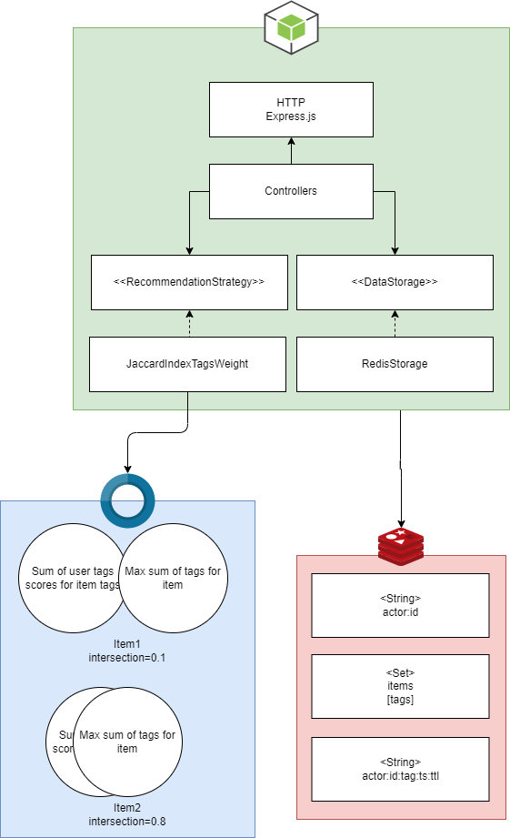

<p style="text-align: center;" align="center">
 
</p>

# recommendation
Open source recommendation system based on time-series data and statistical analysis. Written in TypeScript and Node.js using Redis for storage.

### Features
* Use tag score and Jaccard index
* Content based filtering
* Event-driven powered engine
* Suitable for product and content recommendation
* Fine-tuning of tag weights
* Minimalist and lightweight
* Written in TypeScript and Node.js

<p style="text-align: center;" align="center">
 
</p>

### Getting started
```sh
git clone
yarn
yarn start
```

### API
Set (add or replace) actor
```
POST /api/actors
{
    "externalId": "string"
}
```

Get specific actor by actorId
```
GET /api/actors/:actorId
```

Get recommendation for actor
```
GET /api/actors/:actorId/recommendation
```

Delete specific actor
```
DELETE /api/actors/:actorId
```

Add new event to an actor
```
POST /api/actors/:actorId/events
{
    "tag": "tag1",
    "score": 3,
    "ttl": 60
}
```

Set (add or replace) item
```
POST /api/items
{
    "externalId": "string",
    "tags": ["tag1", "tag2", "..."]
}
```

Get specific item by itemId
```
GET /api/items/:itemId
```

Delete specific item
```
DELETE /api/items/:itemId
```

### License
```
MIT
```
