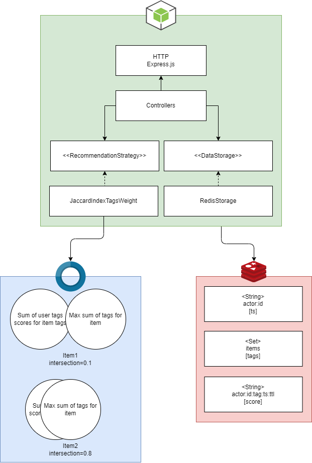

<p style="text-align: center;" align="center">
 
</p>

# recommendation
Open source recommendation system based on time-series data and statistical analysis. Written in ``TypeScript`` and ``Node.js`` using ``Redis`` for storage. The recommendation system uses the ``Jaccard index`` to calculate the intersection between two sets. One set is represented by the maximum possible sum of tag score and the other set is the score sum of user events per tag. The higher the Jaccard index, the higher the recommendation. It uses numbers to represent sets to increase performance.

## Features
* Use tag score and Jaccard index
* Content-based filtering
* Event-driven powered engine
* Naive exploration of new tags
* Suitable for product and content recommendation
* Fine-tuning of tag weights
* Minimalist and lightweight
* Written in TypeScript and Node.js

<p style="text-align: center;" align="center">
 
</p>

## How it works

### How the data is stored:
* Actors are stored in Redis as simple ``String`` keys with create date ``timestamps`` as value.
* Items are ``Set`` type with ``tags`` as members. The item may have multiple tags.
* Events are ``String`` type with ``actorId:id:tag:timestamp:ttl`` and an expire attribute set to ensure freshness of recommendations.

### How the data is accessed:
* Get the actor with events
  * Check if the actor exists with ``EXISTS actor:${id}``
  * Get all user events with ``SCAN ${loop cursor} MATCH actor:${id}``
* Delete a single actor
  * Scan for each related to actor key ``SCAN ${loop cursor} MATCH actor:${id}*``
  * For each key delete with ``DEL ${key}``
* Add a single actor
  * Scan for each related to actor key ``SCAN ${loop cursor} MATCH actor:${id}*``
  * For each key delete with ``DEL ${key}``
  * Add new actor with ``SET actor:${id} ${Date.now().toString()}``
* Add a single event
  * Check if actor exists if flag is set using ``EXISTS actor:${id}``
  * Add event with ``SET actor:${id}:${tag}:${date}:${ttl} ${score}``
  * If ``TTL`` has been provided, set expiration for event with ``EXPIRE actor:${id}:${tag}:${date}:${ttl} ${ttl}``
* Get all items with tags
  * Get all items with ``SCAN ${loop cursor} MATCH item:*``
  * For each item get all tags with ``SMEMBERS ${itemKey}``
* Get a single item with tags
  * Get all tags of item with ``SMEMBERS item:${id}``
* Delete single item
  * Call with ``DEL item:${id}``
* Add a single item
  * Check if item already exists ``EXISTS item:${id}``
  * If so, then remove ``DEL item:${id}``
  * And add item with tags ``SADD item:${id} ${tags}``

## How to run it locally?
```sh
# clone repository with the source code
git clone

# install dependencies
yarn

# build the application from ts to js
yarn build

# start the application
yarn start

# alternatively use ts-node in the developer mode
yarn dev
```

## Deployment
To make deploys work, you need to create free account on [Redis Cloud](https://redis.info/try-free-dev-to)

<a href="https://heroku.com/deploy">
  
</a>

<a href="https://deploy.cloud.run">
  
</a>

## Tests
To run tests use the following command:
```sh
yarn test
```
You should see the following output:
```ts
 PASS  src/__tests__/recommendations.spec.ts
  Recommendations
    √ should item 1 has score 1 and be the first (7 ms)
    √ should item 2 has score 1 and be the first (1 ms)
    √ should return two recommendation with the same score of 1 (1 ms)
    √ should return two recommendation with the same score of 0.5
    √ should return three recommendation with 1, 1 and 0.5 score

 PASS  src/__tests__/envs.spec.ts
  Envs
    √ should return one recommendation (2 ms)
    √ should return two recommendations
    √ should return recommendation with 0.125 score (1 ms)
    √ should return recommendation with 0.0625 score
    √ should clamp results to 0
```

### Environment variables
```sh
# redis host
REDIS_HOST="localhost"

# redis port
REDIS_PORT="6379"

# redis password
REDIS_PASSWORD="mysecretpassword"

# write additional logs to stdout
VERBOSE="true"

# do not check if an actor exists when adding an event
DO_NOT_CHECK_ACTOR_EXISTENCE="true"

# maximum size of a candidate pool of items to calculate recommendation positions
ITEMS_LIMIT="100000"

# maximum number of events to use for recommendation calculation
EVENTS_LIMIT="100000"

# maximum number of recommendations to return
RECOMMENDATIONS_LIMIT=100

# wait to finish event insertion before http response
WAIT_FOR_EVENT_INSERTION="false"

# chance of recommending irrelevant item, used for exploration of new tags
# to minimize the recommendation bubble effect
EXPLORATION_NOISE="0.1"

# max sum of events score set per tag
# e.g. 1 (view event) + 2 (like event) + 5 (lead event) = 8 
JACCARD_MAX_TAG_SCORE="8"

# clamp the recommendation results between 0 and 1
JACCARD_CLAMP_RESULT_RECOMMENDATIONS="true"
```

### API
Set (add or replace) actor
```ts
POST /api/actors
{
    "externalId": "string"
}
```

Get specific actor by actorId
```ts
GET /api/actors/:actorId
```

Get recommendation for actor
```ts
GET /api/actors/:actorId/recommendation
```

Delete specific actor
```ts
DELETE /api/actors/:actorId
```

Add new event to an actor
```ts
POST /api/actors/:actorId/events
{
    "tag": "tag1",
    "score": 3,
    "ttl": 60
}
```

Set (add or replace) item
```ts
POST /api/items
{
    "externalId": "string",
    "tags": ["tag1", "tag2", "..."]
}
```

Get specific item by itemId
```ts
GET /api/items/:itemId
```

Delete specific item
```ts
DELETE /api/items/:itemId
```

## More Information about Redis Stack

Here some resources to help you quickly get started using Redis Stack. If you still have questions, feel free to ask them in the [Redis Discord](https://discord.gg/redis) or on [Twitter](https://twitter.com/redisinc).

### Getting Started

1. Sign up for a [free Redis Cloud account using this link](https://redis.info/try-free-dev-to) and use the [Redis Stack database in the cloud](https://developer.redis.com/create/rediscloud).
1. Based on the language/framework you want to use, you will find the following client libraries:
    - [Redis OM .NET (C#)](https://github.com/redis/redis-om-dotnet)
        - Watch this [getting started video](https://www.youtube.com/watch?v=ZHPXKrJCYNA)
        - Follow this [getting started guide](https://redis.io/docs/stack/get-started/tutorials/stack-dotnet/)
    - [Redis OM Node (JS)](https://github.com/redis/redis-om-node)
        - Watch this [getting started video](https://www.youtube.com/watch?v=KUfufrwpBkM)
        - Follow this [getting started guide](https://redis.io/docs/stack/get-started/tutorials/stack-node/)
    - [Redis OM Python](https://github.com/redis/redis-om-python)
        - Watch this [getting started video](https://www.youtube.com/watch?v=PPT1FElAS84)
        - Follow this [getting started guide](https://redis.io/docs/stack/get-started/tutorials/stack-python/)
    - [Redis OM Spring (Java)](https://github.com/redis/redis-om-spring)
        - Watch this [getting started video](https://www.youtube.com/watch?v=YhQX8pHy3hk)
        - Follow this [getting started guide](https://redis.io/docs/stack/get-started/tutorials/stack-spring/)

The above videos and guides should be enough to get you started in your desired language/framework. From there you can expand and develop your app. Use the resources below to help guide you further:

1. [Developer Hub](https://redis.info/devhub) - The main developer page for Redis, where you can find information on building using Redis with sample projects, guides, and tutorials.
1. [Redis Stack getting started page](https://redis.io/docs/stack/) - Lists all the Redis Stack features. From there you can find relevant docs and tutorials for all the capabilities of Redis Stack.
1. [Redis Rediscover](https://redis.com/rediscover/) - Provides use-cases for Redis as well as real-world examples and educational material
1. [RedisInsight - Desktop GUI tool](https://redis.info/redisinsight) - Use this to connect to Redis to visually see the data. It also has a CLI inside it that lets you send Redis CLI commands. It also has a profiler so you can see commands that are run on your Redis instance in real-time
1. Youtube Videos
    - [Official Redis Youtube channel](https://redis.info/youtube)
    - [Redis Stack videos](https://www.youtube.com/watch?v=LaiQFZ5bXaM&list=PL83Wfqi-zYZFIQyTMUU6X7rPW2kVV-Ppb) - Help you get started modeling data, using Redis OM, and exploring Redis Stack
    - [Redis Stack Real-Time Stock App](https://www.youtube.com/watch?v=mUNFvyrsl8Q) from Ahmad Bazzi
    - [Build a Fullstack Next.js app](https://www.youtube.com/watch?v=DOIWQddRD5M) with Fireship.io
    - [Microservices with Redis Course](https://www.youtube.com/watch?v=Cy9fAvsXGZA) by Scalable Scripts on freeCodeCamp

### License
```
MIT
```
